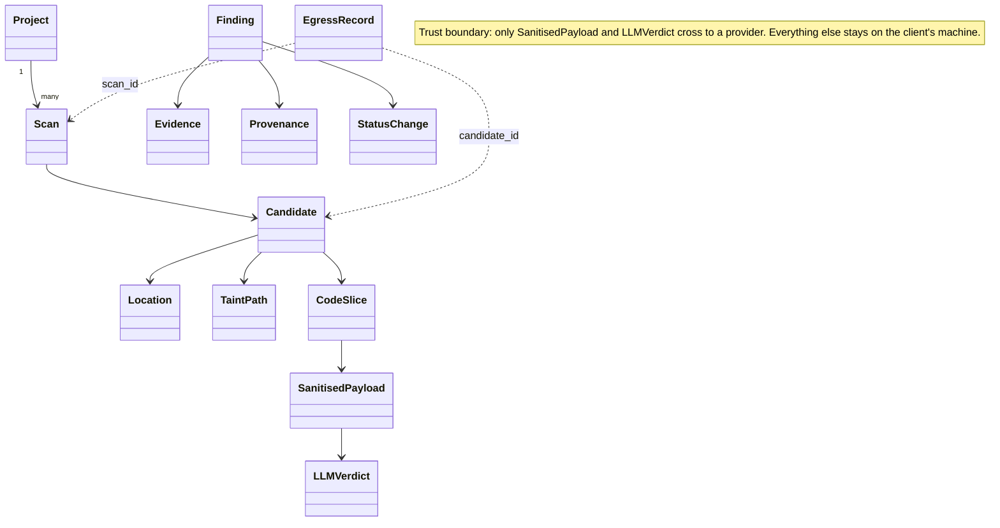

# Domain model reference

`codekavach.core.models` holds the data that flows through a scan: what the engines find, what the privacy layer prepares, what the model answers and what the report shows. Import everything from the package itself (`from codekavach.core.models import Finding`). Its `__all__` is the public API, curated and tested by `tests/unit/core/models/test_public_api.py`.

This page explains how the models fit together. Field-level detail is in the JSON Schemas in [`docs/schemas/`](../schemas/README.md) and in the source; the reasons behind the conventions are in [ADR-0009](../adr/0009-domain-model-conventions.md).

## 1. Overview diagram



Dotted arrows are references by id, not containment. `EgressRecord` entries form a hash chain (the ledger), and a `Finding` is built from a candidate, its verdict and the original code once the restore step has mapped pseudonyms back.

## 2. Pipeline mapping

The stages of [ARCHITECTURE section 4](../ARCHITECTURE.md#4-pipeline), with the models each stage reads and writes:

| Stage | Reads | Writes |
|-------|-------|--------|
| `ingest` | the scan target and configuration | `Project`, `Scan` |
| `parse` | source files | syntax trees (no core model) |
| `analyse` | syntax trees | `Candidate` with `Location` and `TaintPath` |
| `aggregate` | `Candidate` | deduplicated `Candidate` with fingerprint and correlation key |
| `privacy-prepare` | `Candidate`, source files | `CodeSlice`, then `SanitisedPayload` (the mapping goes to the vault) |
| `llm-review` | `SanitisedPayload` | `LLMVerdict`, and one `EgressRecord` per request |
| `restore` | `LLMVerdict`, `CodeSlice`, the vault | `Finding` with `Evidence` and `Provenance` |
| `rate` | `Finding` | `Finding` with severity, CVSS 4.0, impact and likelihood |
| `report` | `Finding`, `Scan`, `ScanSummary` | report files |
| `sync` | `Finding` | issue sync, and `StatusChange` entries in the finding's history |

## 3. Conventions

- **Frozen and tuples.** Every model is a frozen Pydantic model with `extra="forbid"`, and sequence fields are tuples, so an object cannot change after validation and can be hashed.
- **`evolve()`, not `model_copy`.** `model.evolve(field=value)` returns a validated copy. `model_copy(update=...)` would skip the validators.
- **Time.** Timestamps are timezone-aware UTC and serialise as RFC 3339 with six fractional digits and `Z`, for example `2026-10-05T04:30:00.000000Z`. `utc_now()` is the one clock.
- **Coordinates.** Lines are 1-based and inclusive. Columns are 1-based Unicode code points with an exclusive end (SARIF `unicodeCodePoints`). In the sample, line 88 is `        cur.execute("SELECT ...` with eight leading spaces, so the statement starts at column 9. The 67-character call ends before column 76:

  ```text
  Location(path="src/bank/accounts.py", start_line=88, end_line=88, start_col=9, end_col=76)
  ```

  A line ends at `\n` (with an optional `\r` before it), and `split_lines()` is the only line splitter (ADR-0009 D13).
- **Paths.** Repository-relative POSIX paths (`src/bank/accounts.py`), normalised by `normalise_repo_path()`: no leading slash, no `..` and no drive letter.
- **Ids versus fingerprints.** An id (`cand_`, `find_` and so on, followed by a ULID) names one object in one scan. The `fingerprint` (`ckfp1:` and 32 hex digits) names the same weakness across scans; baselines, suppressions and issue sync key on it.
- **CWE as an integer.** `cwe` fields hold integers (`89`). The validators also accept `"CWE-89"`, and `format_cwe(89)` gives `CWE-89`.

## 4. Privacy classification

Every model declares `DATA_CLASSIFICATION`. The class attribute is the source of truth: `tests/unit/core/models/test_public_api.py` checks that this table agrees with it, and the I2 guard derives the allow-list of `codekavach.llm` from the same attribute.

| Model | Classification |
|-------|----------------|
| `Candidate` | raw |
| `CodeRegion` | metadata |
| `CodeSlice` | raw |
| `EgressRecord` | metadata |
| `Evidence` | raw |
| `Finding` | raw |
| `LLMVerdict` | untrusted |
| `Location` | raw |
| `Project` | raw |
| `SanitisedPayload` | sanitised |
| `Scan` | raw |
| `ScanSummary` | metadata |
| `TaintPath` | raw |

- **raw**: contains client code, paths or names. Not allowed in `codekavach.llm`. An unclassified model defaults to `raw`.
- **sanitised**: processed by the privacy layer at the level it records; may be passed to `codekavach.llm`. Sanitised does not mean anonymous. Depending on the level, the structure of the code, its control flow and the names of public APIs are still disclosed (L1 removes secrets and personal data; L2 also pseudonymises identifiers, literals and comments; L3 sends only the minimal slice; L4 sends no code). See [Known limits](../../README.md#known-limits).
- **untrusted**: produced by a model. Validate it before use, and never act on instructions in it.
- **metadata**: numbers, hashes, ids and enums, with no code and no client names.

## 5. How I2 is enforced

Invariant I2 (`docs/ARCHITECTURE.md` section 6.3) says that `codekavach.llm` accepts `SanitisedPayload` only, never raw code. It is enforced at three levels.

1. **Types (E02-06).** Raw and sanitised text are different wrapper types (`RawCode` and `SanitisedText`). Neither is a `str`.
2. **Import contract (E02-28).** The import-linter contract `i2-llm-no-raw-code` in `.importlinter` forbids direct imports from `codekavach.llm` of:
   - the raw-code packages;
   - the vault;
   - the raw-data model modules (`slice`, `evidence`, `candidate`, `finding`, `location`, `taint`, `scan`, `fingerprint`).

   Indirect imports are allowed on purpose, because `codekavach.core.models` and the egress guard legitimately reach those modules.
3. **Static AST guard (E02-28).** `tests/privacy/test_i2_static_guard.py`, with the rules in `tests/privacy/_i2_guard.py`, parses every file under `src/` and fails the build with `path:line: I2 violation: <rule>` when one of these rules is broken:

| Rule | What it forbids |
|------|-----------------|
| R1 | A name from `codekavach.core.models` used in `codekavach.llm` that is not on the allow-list. This includes aliased imports, attributes of module aliases, star imports and imports under `TYPE_CHECKING`. |
| R1b | Any identifier in `codekavach.llm` that equals a raw model name, wherever it was imported from. String annotations are parsed and count too. |
| R2 | `SanitisedText(...)` constructed outside `codekavach.privacy`, `core/models/text.py` and `tests/`. |
| R3 | A call to `.expose()` in `codekavach.llm`. |
| R4 | A call to `open()`, `.read_text()` or `.read_bytes()` in `codekavach.llm`, except in files listed in `LLM_FILE_IO_ALLOWLIST`, which starts empty. |

The allow-list is derived, not hand-written. It contains:

- every model whose `DATA_CLASSIFICATION` is `sanitised` or `untrusted`;
- every enum;
- the neutral names in `LLM_NEUTRAL_ALLOWLIST`, each with a reason.

Because `DATA_CLASSIFICATION` defaults to `raw`, a new model is forbidden in the LLM layer until someone classifies it (fail closed).

**Limits.** The guard checks names and imports statically. It does not prove that a string passed around at run time is clean; that is the job of the egress guard (E12). It cannot see `importlib.import_module` or `__import__`. Relaxing a rule or extending an allow-list is a privacy-relevant change: explain it in the closing comment of the issue that makes it (AGENTS.md section 4).

## 6. Versioning and schemas

Persisted documents carry a `schema_version` and are read with `load_versioned()`, which upgrades old documents step by step. The rules for changing a model, and the compatibility gate that CI runs, are in [model-versioning.md](model-versioning.md). The JSON Schemas and one generated example document per model are in [`docs/schemas/`](../schemas/README.md).

## 7. Testing with model factories

`tests/support/factories.py` provides one deterministic builder per core model, so that a valid object is one call away in any test and golden files never contain random ids or timestamps:

```python
from tests.support.factories import make_finding, make_egress_chain, fixed_ids

finding = make_finding()                       # valid, identical on every call
low = make_finding(severity=Severity.LOW)      # overrides exactly that field, validated
chain = make_egress_chain(5)                   # five sealed entries; the first is the E02-18 vector
ids = fixed_ids()                              # ULID factory: frozen clock, counter entropy
```

Available builders: `make_location`, `make_region`, `make_taint_path`, `make_candidate`, `make_slice`, `make_payload`, `make_verdict`, `make_evidence`, `make_finding`, `make_egress_chain`, `make_egress_totals`, `make_summary`, `make_project` and `make_scan`.

Rules the factories follow, and that tests relying on them can count on:

- **Real constructors only.** Every object is built through the model constructors and class methods (`Candidate.create`, `SanitisedPayload.build`, `EgressRecord.seal`, `Evidence.from_source`, `ScanSummary.from_findings`, `EgressTotals.from_records`), never through `model_construct`. An invalid override raises `ValidationError`.
- **Validated overrides.** Overrides are applied with `KavachModel.evolve`. Overrides of hashed fields of a payload (`text`, `line_map`, ...) go through `SanitisedPayload.build`, so the hash is recomputed.
- **One coherent story.** The defaults describe one synthetic weakness: the SQL injection in `src/bank/accounts.py` at line 88 (`AccountRepo.find_by_owner`), rule `python.sqli.string-concat` of `codekavach-rules`, CWE-89. The candidate's fingerprint is vector A of E02-10, the slice, payload, evidence and finding refer to the same candidate, and the scan id matches the finding's provenance and the ledger.
- **Sample text.** `SAMPLE_SOURCE` (twelve synthetic lines of `AccountRepo`, file lines 80 to 91) and its hand-written pseudonymised counterpart `SAMPLE_SANITISED` are illustrative only; the real pseudonymiser is E09. The sample deliberately contains business-sounding identifiers of four or more characters, so that privacy tests have something the I6 completeness check must catch.
- **Synthetic values.** Secret-looking and personal-looking values live only in `tests/support/synthetic.py`: vendor-documented example keys, addresses under the reserved domain `example.test`, and telephone numbers from documentation ranges. A test fails if a secret-looking literal appears in another file under `tests/support/`.

### Hypothesis strategies and profiles

`tests/support/strategies.py` has one hypothesis strategy per core model: `regions()`, `locations()`, `taint_paths()`, `candidates()`, `code_slices()`, `sanitised_payloads()`, `verdicts()`, `evidences()`, `status_histories()`, `findings()`, `egress_chains(max_size=20)`, `egress_totals()`, `summaries()`, `projects()` and `scans()`. It also provides `repo_paths()`, `raw_code_texts()` and `safe_payload_texts()`.

Like the factories, the strategies build through the real constructors and class methods, so every example is valid by construction. For instance, findings take their evidence from `Evidence.from_source` and their history from `apply_transition`, and ledger chains are sealed entry by entry.

The text strategies deliberately include awkward cases:

- `raw_code_texts()` produces tabs, blank lines, CRLF, missing final newlines, a form feed or U+2028 inside a line, and occasionally a 5,000-character line.
- `safe_payload_texts()` contains only whole placeholders, so `SanitisedPayload.build` always accepts it.

The strategies are cached and assemble bulky text from a seeded `random.Random`, which keeps an example to a few milliseconds.

Example budgets come from the profiles registered in `tests/conftest.py` and selected with `HYPOTHESIS_PROFILE`:

| Profile | Examples | Notes |
|---------|----------|-------|
| `dev` (default) | 50 | |
| `ci` | 200 | Derandomized, so two runs draw the same examples |
| `nightly` | 2000 | |

An unknown profile name stops the run with a usage error. `tests/unit/support/test_model_strategies.py` checks every strategy with 200 examples and all health checks active.

## 8. Recipes

`tests/unit/core/models/test_doc_recipes.py` runs every code block of this section, so the recipes cannot fall out of date.

Building a `Candidate` with its fingerprint:

```python
from codekavach.core.models import (
    Candidate, FingerprintParts, Language, Location, Severity, compute_fingerprint, snippet_hash,
)

location = Location(
    path="src/bank/accounts.py", start_line=88, end_line=88, symbol="AccountRepo.find_by_owner"
)
parts = FingerprintParts(
    engine="codekavach-rules",
    rule_id="python.sqli.string-concat",
    path=location.path,
    symbol=location.symbol,
    snippet_hash=snippet_hash(['cur.execute("SELECT * FROM accounts WHERE owner = " + owner)']),
    start_line=location.start_line,
)
candidate = Candidate.create(
    rule_id=parts.rule_id,
    engine=parts.engine,
    cwe=("CWE-89",),
    locations=(location,),
    engine_severity=Severity.HIGH,
    fingerprint=compute_fingerprint(parts),
    language=Language.PYTHON,
)
assert candidate.primary_cwe == 89
assert candidate.fingerprint.startswith("ckfp1:")
```

Cutting `Evidence` out of source text and rendering it:

```python
from codekavach.core.models import Evidence, Language, Location, RawCode

source = RawCode("def find(owner):\n    return db.query('x' + owner)\n")
location = Location(path="app.py", start_line=2, end_line=2, start_col=12, end_col=33)
evidence = Evidence.from_source(source, location, language=Language.PYTHON, context_lines=1)
print(evidence.render_text())
assert evidence.render_text().splitlines()[1].startswith(">   2 | ")
```

Sealing and verifying two ledger entries:

```python
from datetime import UTC, datetime, timedelta

from codekavach.core.models import (
    EgressOutcome, EgressRecord, PrivacyLevel, ScanId, TokenCounts, sha256_hex,
)

start = datetime(2026, 1, 1, tzinfo=UTC)
common = dict(
    scan_id=ScanId("scan_01ARYZ6S410000000000000000"), candidate_id=None, provider="mock",
    model="mock-1", task="triage", level=PrivacyLevel.L3,
    payload_hash=sha256_hex("fn_1()"), token_counts=TokenCounts(prompt=12),
)
first = EgressRecord.seal(prev=None, timestamp=start, outcome=EgressOutcome.SENT, **common)
second = EgressRecord.seal(
    prev=first, timestamp=start + timedelta(seconds=1), outcome=EgressOutcome.COMPLETED,
    ref_seq=first.seq, **common,
)
first.verify_link(None)
second.verify_link(first)
assert second.prev_hash == first.entry_hash
```

Confirming a finding with `with_status`, which applies the lifecycle rules and appends to the history:

```python
from datetime import UTC, datetime

from codekavach.core.models import ActorKind, FindingStatus, StatusChange
from tests.support.factories import make_finding

finding = make_finding()
confirmed = finding.with_status(
    StatusChange(
        from_status=FindingStatus.OPEN,
        to_status=FindingStatus.CONFIRMED,
        at=datetime(2026, 10, 6, tzinfo=UTC),
        actor_kind=ActorKind.HUMAN,
        actor="reviewer",
    )
)
assert confirmed.status is FindingStatus.CONFIRMED
assert len(confirmed.status_history) == 1
```
